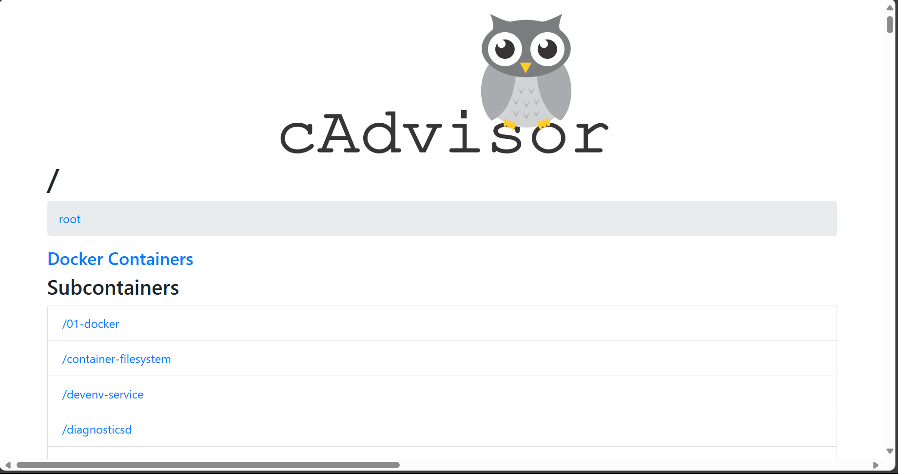
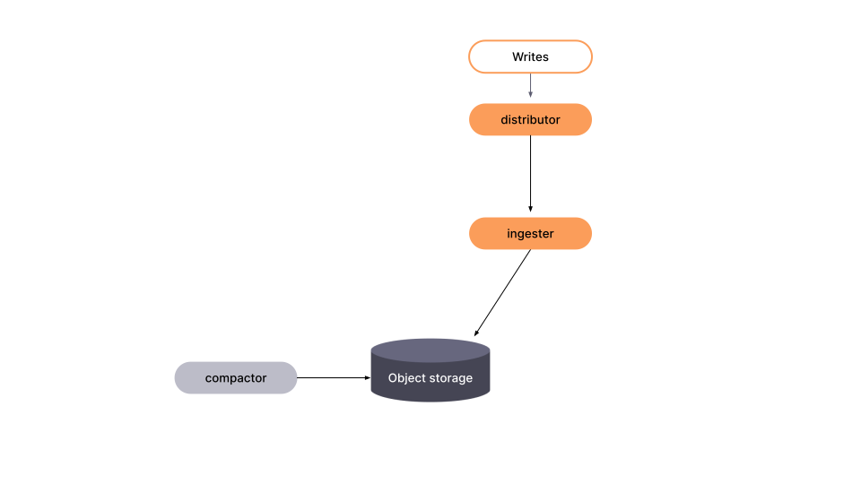
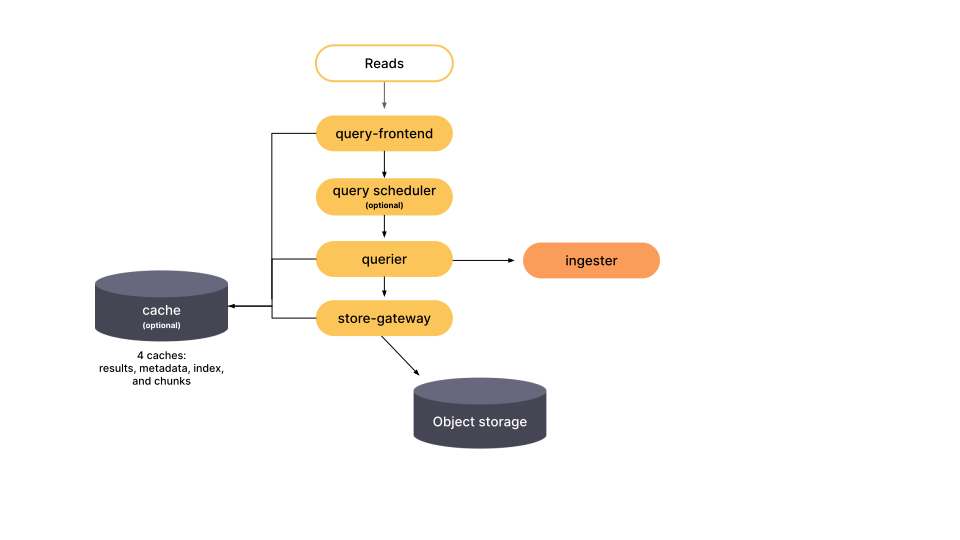
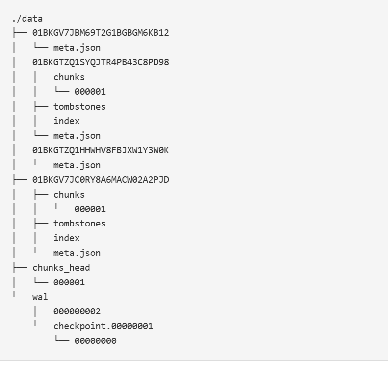

<h1>Grafana Mimir Documentation</h1>

## Grafana Mimir

Grafana Mimir is a powerful, open-source time-series database optimized for storing and querying large volumes of metrics. It's built to work seamlessly with Prometheus, a popular monitoring tool.

### Why Grafana Mimir?
- **Scalable**: Handles a vast amount of data without a hitch.
- **Durable**: Uses object storage to keep your data safe over the long term.

Grafana Mimir is compatible with various object store implementations like  Amazon S3, Google Cloud Storage.
In this Repository i am using Grafana Mimir to Store Data in Minio Object Storage

So basically Grafana Mimir helps us to store our Prometheus Data in an Object Store .

<bold>Architecture of Grafana Mimir to write data to Object store</bold>


<h1>The Above Diagram Explain this</h1>

<div>
    <p>Prometheus which is a used for Scrapping Metrics remote writes the data to Mimir</p>
    <p>A load balancer is a device or software that distributes network or application traffic across multiple servers.
    In this Documentation I am using Nginx load balancer which distributes the read and write requests about multiple mimir instances
    </p>
    <p>Mimir Instances are Responsible for doing read and write requests to the object Storage(In our Case we are using Minio for Object Storage)</p>
</div>

**Note:** We will be using docker to setup our service.Make sure you have Docker installed and running on your machine.

<h1>What are the Pre Requisites to run Grafana Mimir?</h1>

<h2>First we will need a Object Storage for Mimir.</h2>
<p>MinIO is a high-performance, S3 compatible object store</p>

# Note: In order to get your Ip_address of your machine run the following command
```bash
ipconfig
```

The below steps are based on settting up Minio Server on windows OS system. If you have a different OS , 
Follow the steps mentioned here for different OS [https://min.io/download]

<bold>Steps to Setup Minio Server on your System</bold>
    
    Run Powershell as an administrator and run the following commands

1. This Command will install the minio executable file in your C Drive
    ```bash
    Invoke-WebRequest -Uri "https://dl.min.io/server/minio/release/windows-amd64/minio.exe" -OutFile "C:\minio.exe"
    
2. This Command will set root user for minio
     ```bash
    setx MINIO_ROOT_USER admin

3. This command will set the password for above user 
    ```bash
    setx MINIO_ROOT_USER password
    
4. This Command will start the minio Server
    ```bash
    C:.\minio.exe server C:\Data --console-address ":9001"

5. Navigate to 'ip_address':9001 and login to minio server with 
    username:admin
    password:password

Now that you have Minio Server running on Port 9001 , let's move forward to next steps.

In this Documentation i will be explaining on how to setup Mimir instances to write data to Minio Object Storage.


1. Navigate to the MicroServices directory and follow the instructions given there to setup your Nodejs MicroService.
2. Now that you have the Micro-Service Setup with appropriate details we will start with our docker compose file.

3. We will be using the following images  from Docker Hub :
    # Grafana : grafana/grafana Running at Port 3000
    Grafana is an open-source platform for monitoring and observability. It allows you to query, visualize, alert on, and understand your metrics no matter where they are stored. With Grafana, you can create, explore, and build dashboards with your team to foster a data-driven culture.


    ### Features:
   - **Visualizations**: Create dynamic and reusable dashboards with a wide range of visualization options.
   - **Alerts**: Set up alerts to notify you of potential issues within your metrics.
   - **Annotations**: Mark events on graphs to provide additional context.
   - **Explore**: Drill down into your metrics for ad-hoc querying and analysis.
   - **Scalability**: Designed to handle large amounts of data, making it suitable for small and large organizations alike.

    Grafana supports a multitude of data sources, including Prometheus, Elasticsearch, and many more, making it a versatile tool for any data-driven team.

    # prometheus : prom/prometheus  Running at Port 9090

     Prometheus collects metrics from configured targets at given intervals, evaluates rule expressions, displays the results, and can trigger alerts if certain conditions are observed.

    ### Features:
    - **Multi-Dimensional Data Model**: Metrics are identified by a name and key/value pairs.
    - **PromQL**: A powerful query language to leverage the dimensionality of data.
    - **Pull Model**: Time series collection via an HTTP pull model.
    - **Service Discovery**: Targets are discovered via service discovery or static configuration.

    Prometheus is particularly well-suited for collecting time-series data in a microservices architecture.
   
    # cadvisor : gcr.io/cadvisor/cadvisor:latest Running at Port 8081

    ## cAdvisor (Container Advisor)

    cAdvisor is an open-source tool that provides container users with insights into resource usage and performance characteristics of their running containers. It's a daemon that collects, aggregates, processes, and exports information about running containers, offering a detailed view of resource isolation parameters, historical resource usage, and network statistics.

    ### Features:
    - **Real-time Metrics**: Tracks CPU, memory, filesystem, and network usage statistics.
    - **Container Efficiency**: Helps identify containers using excessive resources.
    - **Prometheus Integration**: Exports data in Prometheus format for easy integration.
    - **Comprehensive Visibility**: Provides a detailed look at the resource usage of containers.

    cAdvisor is designed to monitor the whole machine and is particularly useful in a microservices architecture where containerization is prevalent.

    # redis : redis:latest 

    The `redis:latest` Docker image is the official Redis server image that provides an in-memory data structure store, used as a database, cache, and message broker. This image is commonly used in conjunction with monitoring tools like cAdvisor to store container metrics efficiently.

    ### Features:
    - **In-Memory Storage**: Offers high-performance data storage and retrieval.
    - **Persistence**: Supports various persistence options for durability.

    # Node-exporter : prom/node-exporter:latest Running at Port 9100

    The `prom/node-exporter:latest` Docker image provides the latest version of the Node Exporter, which is a powerful tool for monitoring system-level metrics on systems. It's designed to collect a wide variety of hardware- and OS-level metrics, making it an essential part of any Prometheus monitoring setup.

    ### Features:
    - **Comprehensive Metrics**: Collects detailed system metrics including CPU, memory, disk, and network utilization.
    - **Prometheus Integration**: Seamlessly integrates with Prometheus for efficient monitoring and alerting.

    # mimir : grafana/mimir:latest

    A Mimir instance refers to a single deployment of Grafana Mimir, which is designed for long-term storage and high-availability monitoring of Prometheus metrics. It's built to handle large-scale data and provides a robust solution for time-series data management.

    ### Features:
    - **Scalable**: Can process and store vast amounts of metrics efficiently.
    - **Durable**: Utilizes object storage for reliable, long-term retention of data.

    # MinIO : minio/minio Running at Port 9001

    MinIO is an open-source object storage service that provides high-performance, S3 compatible storage.
    Here in this Documentation we will be using Minio Object Storage to store Metrics Data.

    ### Key Features:
    - **High Performance**: Optimized for speed with a minimalistic design.
    - **Scalability**: Can handle petabytes of data and millions of objects.
    - **Security**: Provides robust security features, including encryption and access management.


1. Navigate to Prometheus directory and follow the instructions there.
2. After Completing the setup of Prometheus 
3. Go to the config directory and follow the instructions there. 
4. Now we have Setup our Bucket in Minio Server to write  Metric Data.
5. After Completing the setup Mentioned in config directory we have all pre requisites configured

# Now Start the Docker Compose setup in docker-compose.yaml using the below Command

```bash
docker compose build
```
The docker compose build command is used to build or rebuild services defined in a docker-compose.yml file. When you run this command, Docker reads the service definitions that include build instructions from your Compose file and executes the build process for each service
```bash
docker compose up -d
```

This command starts:

# Grafana Mimir
### Three instances of monolithic-mode Mimir to provide high availability
# Minio
### S3-compatible persistent storage for blocks, rules, and alerts
# Prometheus
### Scrapes Grafana Mimir metrics, then writes them back to Grafana Mimir to ensure availability of ingested metrics
# Load balancer
### A simple NGINX-based load balancer that exposes Grafana Mimir endpoints on the host

After Running the Above Command ,Open Command Prompt and Run the Below Command OR open docker Desktop and see multi-container stack running
```bash
docker ps #This Command will list all the running containers
```

## Now that you have all the containers up and running.

Navigate to IP_Address:8081 on your browser
You should see Cadvisor Home Page .
 

- Navigate to docker containers and there you can see a list of sub-containers that cadvisor is monitoring
- Cadvisor provides CPU Usage ,Memory Usage and other stats of the sub-containers.


# Node-exporter 
Node Exporter is a component of the Prometheus monitoring system that collects and exposes a wide range of hardware- and OS-level metrics from systems.
1. Navigate to  http://IP_ADDRESS:9100/metrics which contains hardware and OS-level metrics from systems

# Prometheus

Navigate to IP_Address:9090 where you can see prometheus Home Page

You can write queries here to retreive data 
--> For example you can use the below query to see targets from which prometheus is scrapping data from
```bash
up
```

# Grafana 

Now that we know we are scrapping Metrics Data using Prometheus we have to find a way to visualize it
Grafana comes into play here as a tool for Visualization.
We can see data in form of a table,a time series Graph,a Counter and much more.
Navigate to "IP_ADDRESS:3000"

Login with 
Username : admin 
Password : admin (default creds)
1. So to Visualize the data on Grafana First we need to add a data source
--> Click on Add data source --> Select Prometheus --> Give appropriate details (URL= "IP_ADDRESS:9090") and click Save and Test.You must see the data source is successfully added.
2. Click on Create your first Dashboard --> Add Visualization --> Select Data Source as prometheus 
Run the below query
```bash
container_cpu_usage_seconds_total{job="cadvisor", name="books-services"}
```
This will show us cpu usage of our books-service container.

3. Similarly you can also import in-built dashboards into Grafana. These dashboards provide a wide range of Queries and visualizations to it.

- Click on Dashboards and click new Dashboard,In the Next Interface Choose import Dashboard and provide the below id in the second text box 
```bash
1860
```

- Then Choose Data source as prometheus from dropdown and Click Import.
- After Doing this you will get inbuild node exporter dashboard which will complete information about your system metrics data with graphs and numbers.

# Grafana Mimir Admin

Navigate to IP_Address:9009 where you can see Grafana Mimir Admin Interface 

1. Current Config:
Displays both the default values and any configurations that differ from the defaults.
Provides insights into the current settings for various services.
2. Compactor:
Indicates the status of the ring, which is likely related to data processing or storage efficiency.
Monitoring this can help optimize performance.
3. Distributor:
Shows usage statistics and HA (High Availability) tracker status.
Provides insights into system performance and availability.
4. Ingester:
Displays the status of tenants and the ring.
Offers information on data ingestion processes.
5. Overrides-exporter:
Provides information on the ring’s status.
6. Ruler:
Indicates the status of the ring.
7. Store-gateway:
Shows both tenants & blocks and ring statuses.
8. Memberlist:
Indicates cluster membership status.
Used for coordinating services or tasks across distributed systems.
9. Dangerous:
- Options to trigger a flush of data from ingester to storage (emergency action).
- Also allows triggering ingester shutdown (emergency scenario).
Please note that the “Dangerous” options should be used with caution, as they can impact system behavior significantly. 🚨


# The write path



The diagram shows the following components:

1. Writes: This component writes data to Mimir.
2. Ingester: This component receives data from the distributor and prepares it for storage.
3. Distributor: This component distributes the prepared data to multiple object storage instances.
4. Compactor: This component compacts the data over time to save storage space.Blocks compaction significantly reduces storage utilization
5. Object Storage: This component stores the metrics data. Mimir supports various object storage solutions.
# Here are some additional details about the Mimir architecture:
- Mimir uses a ring architecture to store and replicate data.
- Mimir is designed to be performant and efficient. It can ingest and store large volumes of metrics data.


# The read path


1. Queries coming into Grafana Mimir arrive at the query-frontend. The query-frontend then splits queries over longer time ranges into multiple, smaller queries.
2. The query-frontend next checks the results cache. If the result of a query has been cached, the query-frontend returns the cached results. Queries that cannot be answered from the results cache are put into an in-memory queue within the query-frontend.
3. The queriers act as workers, pulling queries from the queue.

Now Navigate to the minio Server at port 9001 and which we setup earlier

Now you can see some data inside your bucket that we created earlier.
Navigate to demo directory inside your bucket you can see cache data of your metrics

Each on-disk block directory contains an index file, a file containing metadata(meta.json), and the time series chunks.


# The role of Prometheus
Prometheus instances scrape samples from various targets and push them to Grafana Mimir by using Prometheus’ remote write API.

Incoming samples (writes from Prometheus) are handled by the distributor, and incoming reads (PromQL queries) are handled by the query frontend.

Now that we know how Prometheus remote writes data to Object Storage.
Lets build some Dashboards and Visualize the Data on Grafana 

# Set-up Mimir as a Data-source in Grafana Running at Port 3000

1. Navigate to Data Sources --> Add new Data Source --> Select Prometheus Data source
2. Enter Name of Data Source as Mimir and provide prometheus server URL as http://IP_Address:9090
3. Click save and test.
4. On success you will get 
- Successfully queried the Prometheus API.Next, you can start to visualize data by building a dashboard, or by querying data in the Explore view.

# Creating Dashboards on Grafana
## For book-services using Cadvisor
1. Now navigate to Dashboard --> New Dashboard --> Add visualization
2. Choose Data Source as Mimir
3. Add the below Query
```bash
container_network_transmit_packets_total{name="books-services", job="cadvisor"}
```
This query gives us total number of packets sent by books-service container through its network interface.
4. You should now see a graph with time series showing the number of packets sent overtime.Choose Visualization as Gauge to see data in number format.
5. Add visualization and add the below query 
```bash
container_network_receive_packets_total{name="books-services", job="cadvisor"}
```
6. This query gives us total number of packets received by books-service container through its network interface.
7. Similarly add below queries to get visualizations
```bash
container_memory_usage_bytes{name="books-services", job="cadvisor"} # To show memory usage of our book-service
container_cpu_usage_seconds_total{job="cadvisor", name="books-services"} # CPU Usage of our book-service
```

Similarly you can create dashboards for other services too. 

# To view Cadvisor  Dashboard

1. Run the following queries by creating new Dashboard for Cadvisor

```bash
count(container_last_seen{job=~"cadvisor",image!=""})  #This Query returns the number of running containers that are monitored by cadvisor
sum(container_memory_usage_bytes{job="cadvisor",name=~".+",image!=""}) by(name) # Memory usage per Container You can see specific container stats by tapping on the container-name you want.
sum(rate(container_cpu_usage_seconds_total{name=~".*",name=~".+",image!=""}[5m])) by (name) * 100 # This provides cpu usage information about individual containers running inside docker.
```

Similarly in Grafana you can also add 2 Queries and view them in a single  graph, which is called Stacked Graphs.
Add the below  query to see network traffic in Cadvisor

```bash
sum(rate(container_network_receive_bytes_total{id="/"}[5m])) by (id)
```
Scroll down and Click on Add Query and add the below query
```bash
- sum(rate(container_network_transmit_bytes_total{id="/"}[5m])) by (id)
```
Later Click on Run queries you will see the  Network Traffic graph.
Further you can explore the metrics data of cadvisor by going to ip_address:8081/metrics and query accordingly on this data on Grafana.

# Querying Mimir Instances

Create a new Dashboard , Add data source as Mimir and then run the below query :

```bash
cortex_request_duration_seconds_bucket{job="mimir"} # returns a set of time series data that represent the distribution of request durations for the job labeled “mimir”
```

Similarly Add the following queries and visualize them on Grafana
```bash
sum(cortex_request_duration_seconds_bucket{job="mimir",method="GET"}) # returns the total number of read requests made by mimir
sum(cortex_request_duration_seconds_bucket{job="mimir",method="POST"}) # returns total number write requests done by mimir
counter_memberlist_msg_alive{job="mimir"} # This Query is tracking the number of “alive” mimir instances.
```

Further you can explore the metrics data of mimir by going to ip_address:9009/metrics and query accordingly on this data on Grafana.

This GitHub Repository provides a efficient and step by step guide to utilize Grafana Mimir to remote write your metrics data to Object Storage.
This repository also helps  you to monitor your application performance, resource usage and health status with Prometheus & Grafana.
