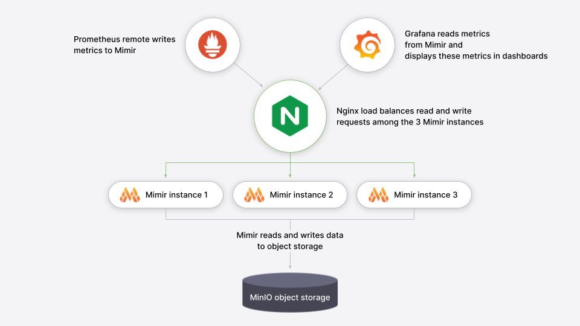

<h1>Grafana Mimir Documentation</h1>

## Grafana Mimir

Grafana Mimir is a powerful, open-source time-series database optimized for storing and querying large volumes of metrics. It's built to work seamlessly with Prometheus, a popular monitoring tool.

### Why Grafana Mimir?
- **Scalable**: Handles a vast amount of data without a hitch.
- **Durable**: Uses object storage to keep your data safe over the long term.

Grafana Mimir is compatible with various object store implementations like  Amazon S3, Google Cloud Storage.
In this Repository i am using Grafana Mimir to Store Data in Minio Object Storage

So basically Grafana Mimir helps us to store our Metrics /Logs in an Object Store .

<bold>Architecture of Grafana Mimir to write data to Object store</bold>

<h1>What are the Pre Requisites to run Grafana Mimir?</h1>

